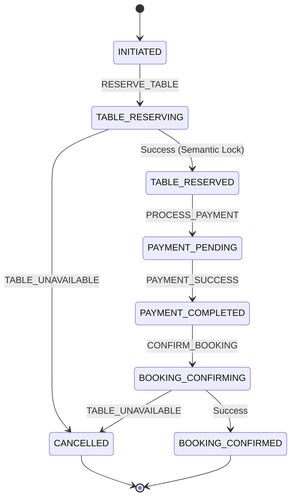

# Báo cáo phân tích bài tập: Xử lý lỗi với giao dịch bù và Semantic Lock

## 1. Kết nối với Bài tập 4
State Machine từ Bài tập 4 đã được mở rộng để hỗ trợ hai khía cạnh quan trọng:
- **Semantic Lock (Khóa ngữ nghĩa):** Sử dụng trạng thái trung gian `RESERVED` nhằm ngăn chặn tình trạng đọc dữ liệu chưa hoàn chỉnh (dirty read) và hiển thị thông báo trạng thái bàn ngay cho người dùng khác.
- **Compensating Transaction (Giao dịch hoàn tác):** Khi bước xác nhận cuối cùng thất bại, thay vì chỉ hủy bỏ đơn hàng, hệ thống tự động sinh bản ghi bù trừ (`REFUND`) để đảm bảo minh bạch tài chính và phục vụ kiểm toán.

## 2. Giải thích Semantic Lock
- **Tại sao cần trạng thái RESERVED?** Nếu chuyển thẳng từ `AVAILABLE` sang `BOOKED`, các luồng yêu cầu đồng thời có thể tranh chấp dữ liệu. Trạng thái `RESERVED` đóng vai trò như một khóa ngữ nghĩa trong ứng dụng giúp tạm giữ tài nguyên trong khoảng thời gian chờ thanh toán hoặc xác nhận.
- **Lợi ích UX:** Khách hàng khác sẽ nhận được cảnh báo ngay lập tức rằng bàn đang được giữ, loại bỏ trải nghiệm thất vọng khi cố gắng đặt một tài nguyên vừa bị người khác chiếm quyền.

## 3. Giải thích Compensating Transaction
- **Tại sao tạo bản ghi REFUND thay vì xóa bản ghi PAYMENT?** Trong các hệ thống tài chính, việc xóa bản ghi gây mất dấu vết kiểm toán (audit trail), phá vỡ tính nhất quán của lịch sử giao dịch và gây khó khăn cho việc đối soát kế toán. Bản ghi `REFUND` (Credit) tạo ra một dòng tiền đảo chiều minh bạch.

## 4. Sơ đồ State Machine và Luồng Saga


## 5. Hướng dẫn cài đặt và chạy dự án
- Yêu cầu: Java 17+, Maven 3.8+
- Lệnh chạy:
```bash
mvn clean spring-boot:run
```
